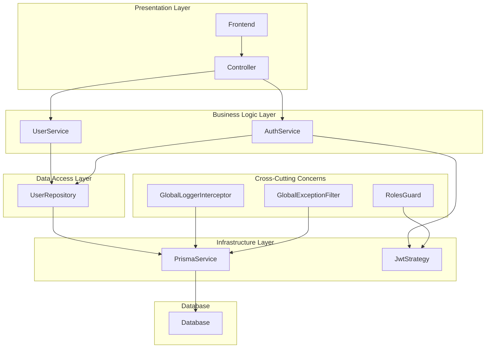

```mermaid
graph TD
    subgraph Presentation Layer
        A[Frontend]
        B[Controller]
    end

    subgraph Business Logic Layer
        C[UserService]
        D[AuthService]
    end

    subgraph Data Access Layer
        E[UserRepository]
    end

    subgraph Infrastructure Layer
        F[PrismaService]
        G[JwtStrategy]
    end

    subgraph Cross-Cutting Concerns
        H[RolesGuard]
        I[GlobalLoggerInterceptor]
        J[GlobalExceptionFilter]
    end

    subgraph Database
        K[Database]
    end

    %% Connections
    A --> B
    B --> C
    B --> D
    C --> E
    D --> E
    E --> F
    F --> K
    D --> G
    H --> G
    I --> F
    J --> F
```