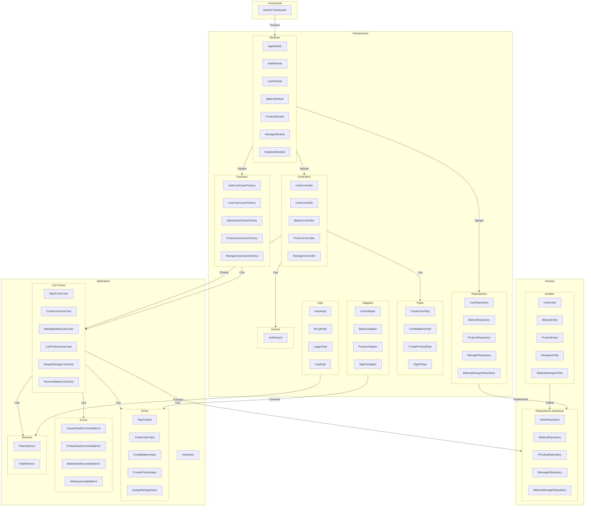

```mermaid
%% Clean Architecture do Projeto Delivery de Padarias

flowchart TB
    %% Camadas Principais
    subgraph Domain ["Domain"]
        direction TB
        DomainEntities["Entities"]
        DomainRepositories["Repositories Interfaces"]
    end

    subgraph Application ["Application"]
        direction TB
        ApplicationUseCases["Use Cases"]
        ApplicationDTOs["DTOs"]
        ApplicationErrors["Errors"]
        ApplicationInterfaces["Interfaces"]
        ApplicationServices["Services"]
    end

    subgraph Infrastructure ["Infrastructure"]
        direction TB
        InfrastructureControllers["Controllers"]
        InfrastructureAdapters["Adapters"]
        InfrastructurePipes["Pipes"]
        InfrastructureRepositories["Repositories"]
        InfrastructureUtils["Utils"]
        InfrastructureModules["Modules"]
        InfrastructureGuards["Guards"]
        InfrastructureFactories["Factories"]
    end

    subgraph Framework ["Framework"]
        direction TB
        FrameworkNestJS["NestJS Framework"]
    end

    %% Relacionamentos entre Camadas
    DomainEntities -->|Define| DomainRepositories
    ApplicationUseCases -->|Usa| DomainRepositories
    ApplicationUseCases -->|Usa| ApplicationDTOs
    ApplicationUseCases -->|Usa| ApplicationErrors
    ApplicationUseCases -->|Usa| ApplicationServices
    InfrastructureControllers -->|Chama| ApplicationUseCases
    InfrastructureControllers -->|Usa| InfrastructurePipes
    InfrastructureControllers -->|Usa| InfrastructureGuards
    InfrastructureAdapters -->|Converte| ApplicationDTOs
    InfrastructureRepositories -->|Implementa| DomainRepositories
    InfrastructureFactories -->|Cria| ApplicationUseCases
    InfrastructureModules -->|Agrupa| InfrastructureControllers
    InfrastructureModules -->|Agrupa| InfrastructureRepositories
    InfrastructureModules -->|Agrupa| InfrastructureFactories
    InfrastructureUtils -->|Fornece| ApplicationServices
    FrameworkNestJS -->|Fornece| InfrastructureModules

    %% Domain Entities
    subgraph DomainEntities ["Entities"]
        UserEntity["UserEntity"]
        BakeryEntity["BakeryEntity"]
        ProductEntity["ProductEntity"]
        ManagerEntity["ManagerEntity"]
        BakeryManagerEntity["BakeryManagerEntity"]
    end

    %% Domain Repositories
    subgraph DomainRepositories ["Repositories Interfaces"]
        IUserRepository["IUserRepository"]
        IBakeryRepository["IBakeryRepository"]
        IProductRepository["IProductRepository"]
        IManagerRepository["IManagerRepository"]
        IBakeryManagerRepository["IBakeryManagerRepository"]
    end

    %% Application Use Cases
    subgraph ApplicationUseCases ["Use Cases"]
        SignInUseCase["SignInUseCase"]
        CreateUserUseCase["CreateUserUseCase"]
        ManageBakeryUseCase["ManageBakeryUseCase"]
        ListProductsUseCase["ListProductsUseCase"]
        AssignManagerUseCase["AssignManagerUseCase"]
        RemoveBakeryUseCase["RemoveBakeryUseCase"]
    end

    %% Application DTOs
    subgraph ApplicationDTOs ["DTOs"]
        SignInInput["SignInInput"]
        CreateUserInput["CreateUserInput"]
        CreateBakeryInput["CreateBakeryInput"]
        CreateProductInput["CreateProductInput"]
        AssignManagerInput["AssignManagerInput"]
    end

    %% Application Errors
    subgraph ApplicationErrors ["Errors"]
        UsuarioNaoEncontradoError["UsuarioNaoEncontradoError"]
        ProdutoNaoEncontradoError["ProdutoNaoEncontradoError"]
        BakeryNaoEncontradaError["BakeryNaoEncontradaError"]
        AtribuicaoInvalidaError["AtribuicaoInvalidaError"]
    end

    %% Application Services
    subgraph ApplicationServices ["Services"]
        TokenService["TokenService"]
        HashService["HashService"]
    end

    %% Infrastructure Controllers
    subgraph InfrastructureControllers ["Controllers"]
        AuthController["AuthController"]
        UserController["UserController"]
        BakeryController["BakeryController"]
        ProductController["ProductController"]
        ManagerController["ManagerController"]
    end

    %% Infrastructure Adapters
    subgraph InfrastructureAdapters ["Adapters"]
        UserAdapter["UserAdapter"]
        BakeryAdapter["BakeryAdapter"]
        ProductAdapter["ProductAdapter"]
        SignInAdapter["SignInAdapter"]
    end

    %% Infrastructure Pipes
    subgraph InfrastructurePipes ["Pipes"]
        CreateUserPipe["CreateUserPipe"]
        CreateBakeryPipe["CreateBakeryPipe"]
        CreateProductPipe["CreateProductPipe"]
        SignInPipe["SignInPipe"]
    end

    %% Infrastructure Repositories
    subgraph InfrastructureRepositories ["Repositories"]
        UserRepository["UserRepository"]
        BakeryRepository["BakeryRepository"]
        ProductRepository["ProductRepository"]
        ManagerRepository["ManagerRepository"]
        BakeryManagerRepository["BakeryManagerRepository"]
    end

    %% Infrastructure Utils
    subgraph InfrastructureUtils ["Utils"]
        AxiosImpl["AxiosImpl"]
        BcryptImpl["BcryptImpl"]
        LoggerImpl["LoggerImpl"]
        UuidImpl["UuidImpl"]
    end

    %% Infrastructure Modules
    subgraph InfrastructureModules ["Modules"]
        AppModule["AppModule"]
        AuthModule["AuthModule"]
        UserModule["UserModule"]
        BakeryModule["BakeryModule"]
        ProductModule["ProductModule"]
        ManagerModule["ManagerModule"]
        DatabaseModule["DatabaseModule"]
    end

    %% Infrastructure Guards
    subgraph InfrastructureGuards ["Guards"]
        AuthGuard["AuthGuard"]
    end

    %% Infrastructure Factories
    subgraph InfrastructureFactories ["Factories"]
        AuthUseCasesFactory["AuthUseCasesFactory"]
        UserUseCasesFactory["UserUseCasesFactory"]
        BakeryUseCasesFactory["BakeryUseCasesFactory"]
        ProductUseCasesFactory["ProductUseCasesFactory"]
        ManagerUseCasesFactory["ManagerUseCasesFactory"]
    end

```