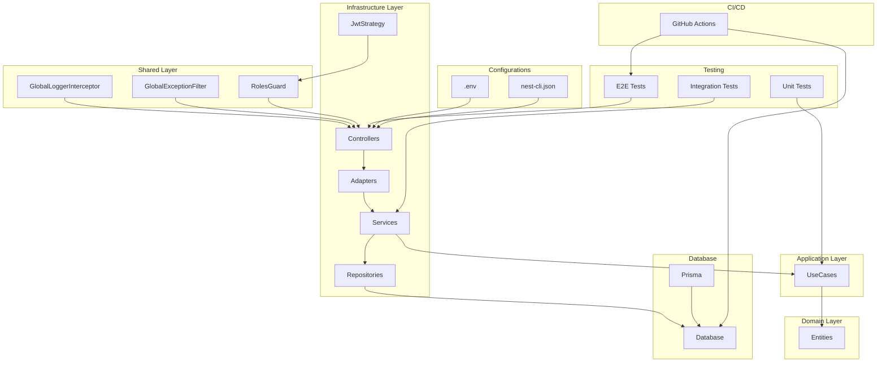

```mermaid
graph TD
    %% Application Layer
    subgraph Application Layer
        A2[UseCases]
    end

    %% Domain Layer
    subgraph Domain Layer
        D1[Entities]
    end

    %% Infrastructure Layer
    subgraph Infrastructure Layer
        A1[Controllers]
        I1[Adapters]
        I2[Repositories]
        I3[Services]
        I4[JwtStrategy]
    end

    %% Shared Layer
    subgraph Shared Layer
        S1[GlobalLoggerInterceptor]
        S2[GlobalExceptionFilter]
        S3[RolesGuard]
    end

    %% Database
    subgraph Database
        DB[Database]
        P1[Prisma]
    end

    %% Configurations
    subgraph Configurations
        C1[.env]
        C2[nest-cli.json]
    end

    %% Testing
    subgraph Testing
        T1[Unit Tests]
        T2[Integration Tests]
        T3[E2E Tests]
    end

    %% CI/CD
    subgraph CI/CD
        CI1[GitHub Actions]
    end

    %% Connections
    A1 --> I1
    I3 --> A2
    I1 --> I3
    A2 --> D1
    I2 --> DB
    I3 --> I2
    I4 --> S3
    S1 --> A1
    S2 --> A1
    S3 --> A1
    P1 --> DB
    T1 --> A2
    T2 --> I3
    T3 --> A1
    CI1 --> T3
    CI1 --> DB
    C1 --> A1
    C2 --> A1
```