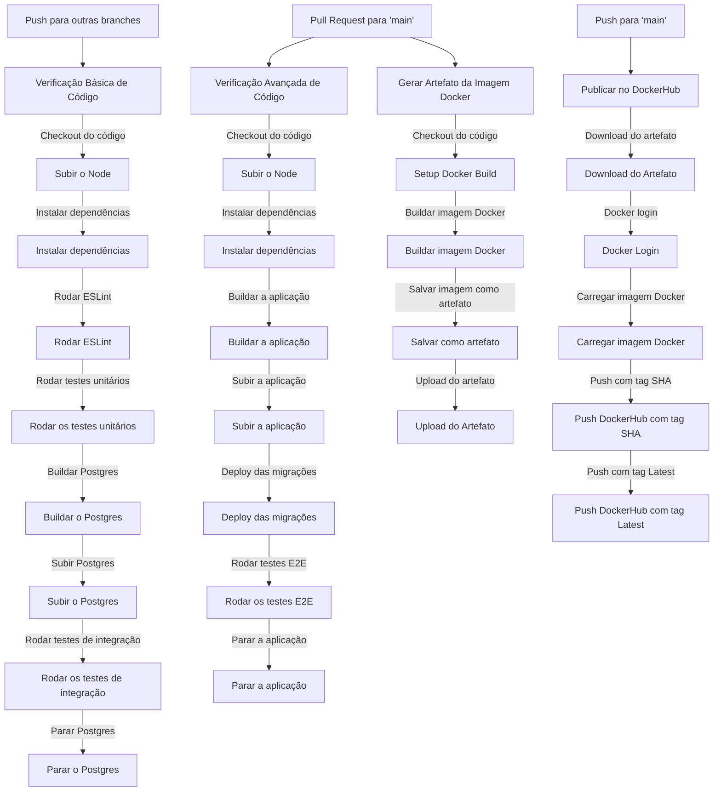

```mermaid
graph TD
    %% Eventos
    A3[Push para outras branches]
    A1[Pull Request para 'main']
    A2[Push para 'main']

    %% Conexões dos eventos
    A3 --> C1[Verificação Básica de Código]
    A1 --> B1[Verificação Avançada de Código]
    A1 --> D1[Gerar Artefato da Imagem Docker]
    A2 --> E1[Publicar no DockerHub]

    %% Verificação Avançada de Código
    B1 -->|Checkout do código| B2[Subir o Node]
    B2 -->|Instalar dependências| B3[Instalar dependências]
    B3 -->|Buildar a aplicação| B4[Buildar a aplicação]
    B4 -->|Subir a aplicação| B5[Subir a aplicação]
    B5 -->|Deploy das migrações| B6[Deploy das migrações]
    B6 -->|Rodar testes E2E| B7[Rodar os testes E2E]
    B7 -->|Parar a aplicação| B8[Parar a aplicação]

    %% Verificação Básica de Código
    C1 -->|Checkout do código| C2[Subir o Node]
    C2 -->|Instalar dependências| C3[Instalar dependências]
    C3 -->|Rodar ESLint| C4[Rodar ESLint]
    C4 -->|Rodar testes unitários| C5[Rodar os testes unitários]
    C5 -->|Buildar Postgres| C6[Buildar o Postgres]
    C6 -->|Subir Postgres| C7[Subir o Postgres]
    C7 -->|Rodar testes de integração| C8[Rodar os testes de integração]
    C8 -->|Parar Postgres| C9[Parar o Postgres]

    %% Gerar Artefato da Imagem Docker (no PR para main)
    D1 -->|Checkout do código| D2[Setup Docker Build]
    D2 -->|Buildar imagem Docker| D3[Buildar imagem Docker]
    D3 -->|Salvar imagem como artefato| D4[Salvar como artefato]
    D4 -->|Upload do artefato| D5[Upload do Artefato]

    %% Publicar no DockerHub (no push para main)
    E1 -->|Download do artefato| E2[Download do Artefato]
    E2 -->|Docker login| E3[Docker Login]
    E3 -->|Carregar imagem Docker| E4[Carregar imagem Docker]
    E4 -->|Push com tag SHA| E5[Push DockerHub com tag SHA]
    E5 -->|Push com tag Latest| E6[Push DockerHub com tag Latest]

```
