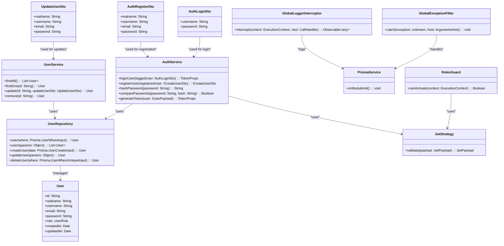

```mermaid
classDiagram
    class User {
        +id: String
        +realname: String
        +username: String
        +email: String
        +password: String
        +role: UserRole
        +createdAt: Date
        +updatedAt: Date
    }

    class UserRepository {
        +user(where: Prisma.UserWhereInput): User
        +users(params: Object): List~User~
        +createUser(data: Prisma.UserCreateInput): User
        +updateUser(params: Object): User
        +deleteUser(where: Prisma.UserWhereUniqueInput): User
    }

    class UserService {
        +findAll(): List~User~
        +findOne(id: String): User
        +update(id: String, updateUserDto: UpdateUserDto): User
        +remove(id: String): User
    }

    class AuthService {
        +loginUser(loggedUser: AuthLoginDto): TokenProps
        +registerUser(registeredUser: ICreateUserDto): ICreateUserDto
        +hashPassword(password: String): String
        +comparePasswords(password: String, hash: String): Boolean
        +generateToken(user: IUserPayload): TokenProps
    }

    class PrismaService {
        +onModuleInit(): void
    }

    class JwtStrategy {
        +validate(payload: JwtPayload): JwtPayload
    }

    class RolesGuard {
        +canActivate(context: ExecutionContext): Boolean
    }

    class GlobalExceptionFilter {
        +catch(exception: unknown, host: ArgumentsHost): void
    }

    class GlobalLoggerInterceptor {
        +intercept(context: ExecutionContext, next: CallHandler): Observable~any~
    }

    class AuthRegisterDto {
        +realname: String
        +username: String
        +email: String
        +password: String
    }

    class AuthLoginDto {
        +username: String
        +password: String
    }

    class UpdateUserDto {
        +realname: String
        +username: String
        +email: String
        +password: String
    }

    UserRepository --> User : "manages"
    UserService --> UserRepository : "uses"
    AuthService --> UserRepository : "uses"
    AuthService --> JwtStrategy : "uses"
    RolesGuard --> JwtStrategy : "uses"
    GlobalLoggerInterceptor --> PrismaService : "logs"
    GlobalExceptionFilter --> PrismaService : "handles"
    AuthRegisterDto --> AuthService : "used for registration"
    AuthLoginDto --> AuthService : "used for login"
    UpdateUserDto --> UserService : "used for updates"
```
