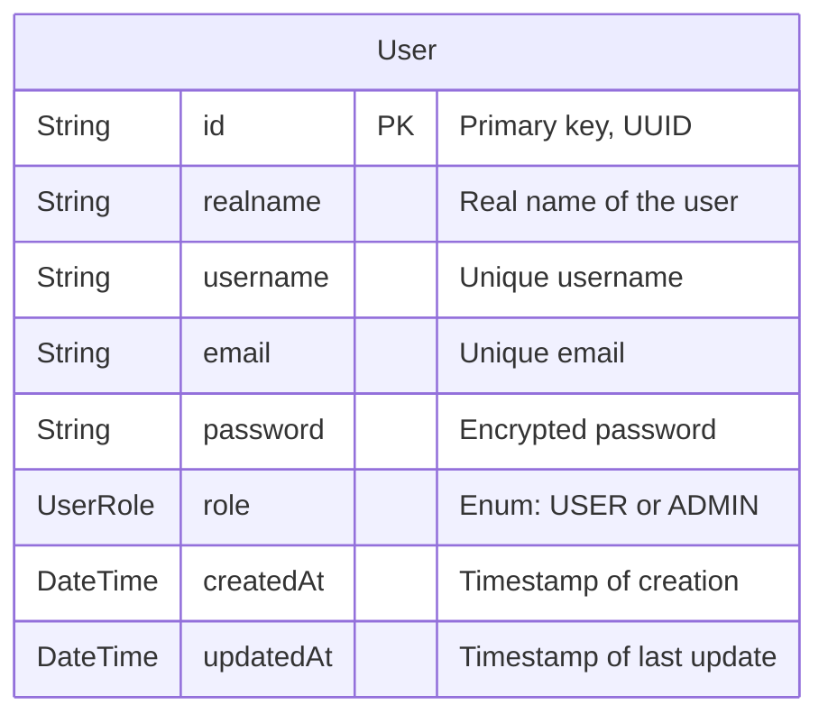

```mermaid
erDiagram
    User {
        String id PK "Primary key, UUID"
        String realname "Real name of the user"
        String username "Unique username"
        String email "Unique email"
        String password "Encrypted password"
        UserRole role "Enum: USER or ADMIN"
        DateTime createdAt "Timestamp of creation"
        DateTime updatedAt "Timestamp of last update"
    }
```
