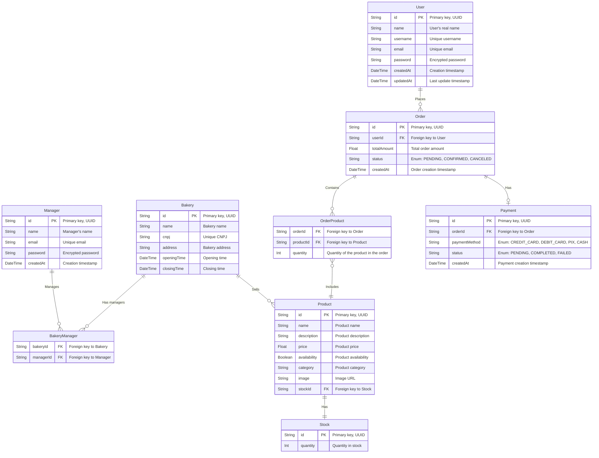

```mermaid
erDiagram
    User {
        String id PK "Primary key, UUID"
        String name "User's real name"
        String username "Unique username"
        String email "Unique email"
        String password "Encrypted password"
        DateTime createdAt "Creation timestamp"
        DateTime updatedAt "Last update timestamp"
    }

    Manager {
        String id PK "Primary key, UUID"
        String name "Manager's name"
        String email "Unique email"
        String password "Encrypted password"
        DateTime createdAt "Creation timestamp"
    }

    Bakery {
        String id PK "Primary key, UUID"
        String name "Bakery name"
        String cnpj "Unique CNPJ"
        String address "Bakery address"
        DateTime openingTime "Opening time"
        DateTime closingTime "Closing time"
    }

    BakeryManager {
        String bakeryId FK "Foreign key to Bakery"
        String managerId FK "Foreign key to Manager"
    }

    Product {
        String id PK "Primary key, UUID"
        String name "Product name"
        String description "Product description"
        Float price "Product price"
        Boolean availability "Product availability"
        String category "Product category"
        String image "Image URL"
        String stockId FK "Foreign key to Stock"
    }

    Stock {
        String id PK "Primary key, UUID"
        Int quantity "Quantity in stock"
    }

    Order {
        String id PK "Primary key, UUID"
        String userId FK "Foreign key to User"
        Float totalAmount "Total order amount"
        String status "Enum: PENDING, CONFIRMED, CANCELED"
        DateTime createdAt "Order creation timestamp"
    }

    OrderProduct {
        String orderId FK "Foreign key to Order"
        String productId FK "Foreign key to Product"
        Int quantity "Quantity of the product in the order"
    }

    Payment {
        String id PK "Primary key, UUID"
        String orderId FK "Foreign key to Order"
        String paymentMethod "Enum: CREDIT_CARD, DEBIT_CARD, PIX, CASH"
        String status "Enum: PENDING, COMPLETED, FAILED"
        DateTime createdAt "Payment creation timestamp"
    }

    User ||--o{ Order : "Places"
    Order ||--o{ OrderProduct : "Contains"
    OrderProduct }o--|| Product : "Includes"
    Order ||--o| Payment : "Has"
    Bakery ||--o{ Product : "Sells"
    Product ||--|| Stock : "Has"
    Bakery ||--o{ BakeryManager : "Has managers"
    Manager ||--o{ BakeryManager : "Manages"
```
