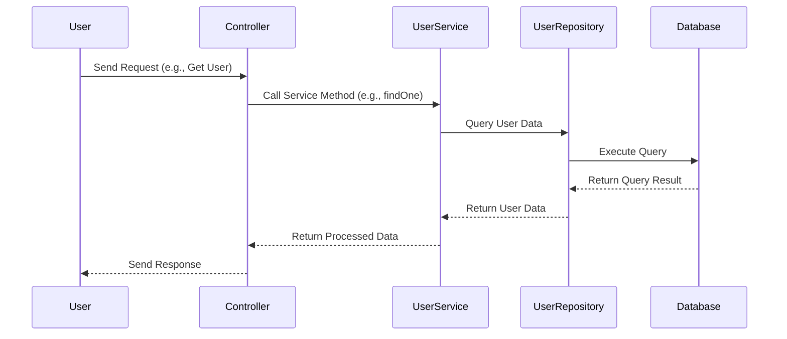

```mermaid
sequenceDiagram
    participant User
    participant Controller
    participant UserService
    participant UserRepository
    participant Database

    User ->> Controller: Send Request (e.g., Get User)
    Controller ->> UserService: Call Service Method (e.g., findOne)
    UserService ->> UserRepository: Query User Data
    UserRepository ->> Database: Execute Query
    Database -->> UserRepository: Return Query Result
    UserRepository -->> UserService: Return User Data
    UserService -->> Controller: Return Processed Data
    Controller -->> User: Send Response
```
